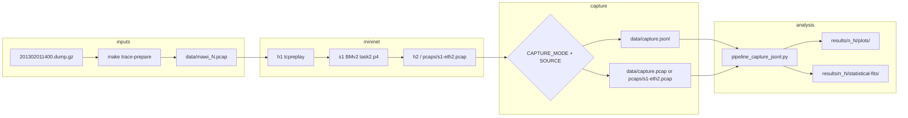

# Task II — In-Network Feature Extraction (P4 / BMv2)

Task II implements **in-network telemetry** on a BMv2 programmable switch: per-packet inter-arrival time (IAT), per-flow packet/byte counters, and export to a collector host. A Python control plane replays the MAWI trace through Mininet, captures telemetry, and produces **Task I–compatible plots and statistical fits** for comparison (Task III).

---

## Table of contents

1. [Architecture](#architecture)
2. [Prerequisites](#prerequisites)
3. [Docker environment](#docker-environment)
4. [End-to-end workflow](#end-to-end-workflow)
5. [Make targets](#make-targets)
6. [Getting telemetry out of the data plane](#getting-telemetry-out-of-the-data-plane)
7. [Thrift vs P4Runtime gRPC](#thrift-vs-p4runtime-grpc)
8. [P4 data plane (`task2.p4`)](#p4-data-plane-task2p4)
9. [Outputs and results layout](#outputs-and-results-layout)
10. [Directory and file reference](#directory-and-file-reference)
11. [Task I / Task III integration](#task-i--task-iii-integration)
12. [Troubleshooting](#troubleshooting)
13. [Known limitations](#known-limitations)

---

## Architecture

### Topology

Mininet emulates a dumb L2 wire through a single P4 switch:

```
                    ┌─────────────────────────────────────┐
  MAWI replay       │              s1 (task2.p4)        │      Collector
  tcpreplay         │  ingress: hash flow, IAT, counters   │      (h2)
       │            │  egress:  telemetry export           │        │
       ▼            └──────────┬──────────────────┬─────────┘        ▼
  ┌─────────┐               p1                  p2            ┌─────────┐
  │   h1    │◄──────────────►│◄────────────────►│───────────►│   h2    │
  │10.0.0.1 │                │                  │            │10.0.0.2 │
  └─────────┘                │                  │            └─────────┘
                             │                  │
                    BMv2 auto-pcap: pcaps/s1-eth1.pcap
                                    pcaps/s1-eth2.pcap  ◄── port 2 (toward h2)
```

| Node | Role |
|------|------|
| **h1** | Injects MAWI packets (`tcpreplay`) on switch port 1 |
| **s1** | Runs `task2.p4` on BMv2; maintains flow registers and telemetry |
| **h2** | Sink / monitor; capture runs here (or read switch port pcap) |

Traffic from h1 is forwarded to h2 (port 1 → 2) and vice versa (port 2 → 1). Telemetry is attached on **egress toward port 2** (packets observed on the h1 → h2 path).

### Data flow



### Control vs data plane

| Layer | Technology | Purpose |
|-------|------------|---------|
| **Data plane** | P4_16 (`task2.p4`), v1model, BMv2 | Per-packet/flow metrics, telemetry export |
| **Runtime** | Mininet + `simple_switch` or `simple_switch_grpc` | Topology, packet forwarding |
| **Control plane** | Python (Thrift CLI or P4Runtime gRPC) | Reset state, set export mode, optional register dump |
| **Analysis** | Python (reuses Task I `task1/src/analysis/`) | JSONL → plots + MLE distribution fits |

---

## Prerequisites

### MAWI trace (replay input)

| File | Location | Use |
|------|----------|-----|
| `201302011400.dump.gz` | **Repo root** (sibling of `task2/`) | Decompressed for replay |
| `201302011400.csv` / `.jsonl` | Repo root | **Task I only** — not injected into BMv2 |

Download if missing:

```text
http://mawi.wide.ad.jp/mawi/samplepoint-F/2013/201302011400.dump.gz
```

Inside Docker the repo root is mounted read-only at `/repo`.

### Host tools (outside Docker)

- Docker Desktop / Docker Engine with `linux/amd64` support
- Optional: 8+ GB RAM for Mininet + BMv2

### Python dependencies

See repo-root `requirements.txt`. **scipy** is required for statistical fits. Install on the host:

```bash
pip install -r requirements.txt   # from repo root
```

Docker: `docker compose build` (uses the same file).

---

## Docker environment

```bash
cd task2
docker compose build
docker compose up -d
docker exec -it task2-p4-env bash
cd /p4
```

| Mount | Path in container | Content |
|-------|-------------------|---------|
| `./task2` | `/p4` | This project (read/write) |
| `..` (repo root) | `/repo` | MAWI dump, Task I code, notebooks (read-only) |

The image is based on `p4lang/p4c` and includes: `p4c`, BMv2 (`simple_switch`, `simple_switch_grpc`), Mininet, `tcpreplay`, `tcpdump`, Python 3 + analysis stack.

---

## End-to-end workflow

Detailed steps also in **[docs/RUN_WITH_MAWI.md](docs/RUN_WITH_MAWI.md)**. Per-method runbooks: **[docs/runbooks/](docs/runbooks/README.md)**.

### 1. Prepare replay PCAP (once)

```bash
cd /p4
make trace-prepare
# -> data/mawi_10000.pcap, data/replay.pcap (symlink)
```

Override packet count: `PACKET_LIMIT=10000 make trace-prepare`

### 2. Compile P4

```bash
make build
# -> build/task2.json, build/task2.p4.p4info.txtpb
```

Re-run after any change to `p4src/task2.p4`.

### 3. Start Mininet

**Homework / gRPC path (recommended):**

```bash
# Terminal A
make run-grpc
# Mininet CLI; P4Runtime on 127.0.0.1:50051
```

**Thrift path:**

```bash
make run-thrift
# simple_switch_CLI on Thrift port 9090
```

### 4. Reset telemetry state

```bash
# Terminal B (same container, new shell)
docker exec -it task2-p4-env bash
cd /p4

# gRPC:
sudo python3 control_plane/controller_grpc.py
# or: make reset-grpc

# Thrift:
sudo python3 control_plane/controller_thrift.py
```

Reset clears flow registers and global IAT state (gRPC path reloads the pipeline; Thrift uses `register_reset`).

### 5. Replay + capture

```bash
# Terminal B — while Mininet is running
REPLAY_MULTIPLIER=0.001 make test-mawi
```

Slow replay avoids BMv2 drops (`REPLAY_MULTIPLIER=0.001` or lower if needed).

### 6. Plot and fit

```bash
python3 control_plane/pipeline_capture_jsonl.py --capture-jsonl data/capture.jsonl
# or after pcap/switch capture:
python3 control_plane/pipeline_capture_jsonl.py --pcap pcaps/s1-eth2.pcap -n 10000
```

Results under `task2/results/n_<N>/`. Precomputed **`n_10000`** plots and fit summaries are committed for the Task III notebook.

### 7. Stop

```text
mininet> exit
```

```bash
make stop
```

---

## Make targets

| Target | Description |
|--------|-------------|
| `make build` | Compile `p4src/task2.p4` → `build/task2.json` + P4Info |
| `make run-thrift` | Mininet + `simple_switch` (Thrift **9090**) |
| `make run-grpc` | Mininet + `simple_switch_grpc` (P4Runtime **50051**) |
| `make trace-prepare` | Decompress MAWI dump → `data/mawi_<N>.pcap` |
| `make test-mawi` | Automated replay + capture (see [Getting telemetry out of the data plane](#getting-telemetry-out-of-the-data-plane)) |
| `make reset-grpc` | Reset telemetry via P4Runtime pipeline reload |
| `make read-registers-grpc` | Dump registers to `data/registers_grpc.json` |
| `make stop` | `mn -c` — tear down Mininet |
| `make clean` | Stop Mininet + remove `build/`, `pcaps/`, `logs/` |

### `make test-mawi` environment variables

| Variable | Default | Meaning |
|----------|---------|---------|
| `PACKET_LIMIT` | `10000` | Packets in replay subset and capture target |
| `REPLAY_MULTIPLIER` | `0.001` | `tcpreplay` rate on h1 (lower if BMv2 drops packets) |
| `CAPTURE_MODE` | `live` | `live`, `pcap`, `udp`, or `switch` |
| `CAPTURE_SOURCE` | `h2` | `h2` or `switch` (in-band / pcap paths) |
| `CAPTURE_TIMEOUT` | `300` | Live / UDP sniff timeout (seconds) |
| `CAPTURE_USE_GRPC` | `0` | Set `1` with `make run-grpc` to configure export mode via P4Runtime |
| `INT_UDP_PORT` | `4790` | UDP INT collector port |
| `SWITCH_PCAP` | `pcaps/s1-eth2_out.pcap` | BMv2 port-2 egress dump (`test_mawi.sh` falls back to legacy `s1-eth2.pcap`) |

---

## Getting telemetry out of the data plane

Task II metrics (IAT, flow counters, timestamps) leave the switch in **three fundamentally different ways**. Per-packet plots and statistical fits need **in-band** or **UDP INT** capture; register readout is a separate, aggregate-only path.

### Two layers: export (P4) vs collection (host)

```
┌─────────────────────────────────────────────────────────────────────────┐
│  s1  task2.p4                                                         │
│                                                                          │
│  Per packet: IAT + flow registers updated in ingress                     │
│                                                                          │
│  EXPORT (egress toward h2)          CONTROL PLANE READ                     │
│  ┌─────────────────────────┐      ┌──────────────────────────┐          │
│  │ ① In-band trailer       │      │ ③ Register snapshot      │          │
│  │    on forwarded frames  │      │    Thrift / P4Runtime    │          │
│  │ ② UDP INT report        │      │    (flow totals only)    │          │
│  │    clone → 10.0.0.2     │      └──────────────────────────┘          │
│  └───────────┬─────────────┘                                             │
└──────────────┼──────────────────────────────────────────────────────────┘
               │
               ▼
┌──────────────────────────────────────────────────────────────────────────┐
│  COLLECTION (where you observe / record export ① or ②)                  │
│                                                                          │
│  A. Live Scapy sniff on h2 (eth0)          → data/capture.jsonl         │
│  B. tcpdump on h2                          → data/capture.pcap           │
│  C. BMv2 switch port dump (auto)           → pcaps/s1-eth2.pcap          │
│  D. UDP INT sniff on h2 (port 4790)        → data/capture.jsonl          │
└──────────────────────────────────────────────────────────────────────────┘
               │
               ▼
     capture_inband.py / capture_udp_int.py → pipeline_capture_jsonl.py → results/n_<N>/
```

| Layer | What you configure | Tools |
|-------|-------------------|--------|
| **P4 export** | `set_export_mode_thrift.py` or `set_export_mode_grpc.py` | Switch program |
| **Collection** | `CAPTURE_MODE` + `CAPTURE_SOURCE` in `make test-mawi` | h2 sniff, tcpdump, or switch pcap |
| **Register read** | `read_registers_thrift.py` / `read_registers_grpc.py` | Thrift 9090 or gRPC 50051 |

---

### Method 1 — In-band telemetry trailer (default)

**What the data plane does:** On egress to port 2, the switch appends a 32-byte `telemetry_t` header after the L3/L4 headers of each forwarded packet. The original MAWI frame is unchanged except for this trailer.

**Best for:** Per-packet IAT distributions, Task I–style plots, homework default path.

**Collection options** (in-band trailer parsed by `capture_inband.py`):

| Collection | Where | Output | `make test-mawi` |
|------------|-------|--------|------------------|
| **Live sniff** | Scapy on h2 `eth0` | `data/capture.jsonl` | `CAPTURE_MODE=live CAPTURE_SOURCE=h2` (default) |
| **h2 tcpdump** | tcpdump on h2 | `data/capture.pcap` | `CAPTURE_MODE=pcap CAPTURE_SOURCE=h2` |
| **Switch pcap** | BMv2 `--pcap` on port 2 | `pcaps/s1-eth2.pcap` | `CAPTURE_MODE=switch` or `CAPTURE_SOURCE=switch` |

```bash
# Automated (live on h2)
REPLAY_MULTIPLIER=0.001 make test-mawi

# Switch port pcap (no collector on h2)
CAPTURE_MODE=switch REPLAY_MULTIPLIER=0.001 make test-mawi
python3 control_plane/pipeline_capture_jsonl.py --pcap pcaps/s1-eth2.pcap -n 10000

# Manual Mininet
mininet> h2 python3 /p4/control_plane/capture_inband.py --interface eth0 -n 10000 -o /p4/data/capture.jsonl &
mininet> h1 tcpreplay -i eth0 --multiplier=0.001 /p4/data/mawi_10000.pcap
```

**Parse / plot:**

```bash
python3 control_plane/capture_inband.py --pcap data/capture.pcap -o data/capture.jsonl
python3 control_plane/pipeline_capture_jsonl.py --capture-jsonl data/capture.jsonl
# or: python3 control_plane/plot_capture_jsonl.py data/capture.jsonl
```

---

### Method 2 — UDP INT report export

**What the data plane does:** Instead of (or in addition to) the in-band trailer, egress **clones** each packet and emits a separate UDP datagram to collector **10.0.0.2:4790**. Payload is a 54-byte `INT1` report (telemetry fields + mirrored 5-tuple). Forwarded traffic on h2 has **no** in-band trailer when export mode is `udp` only.

**Best for:** Production-style telemetry export (out-of-band reports), comparing against in-band capture in Task III.

**Collection:** Scapy UDP sniff on h2 only (`CAPTURE_SOURCE` must be `h2`).

```bash
# Configure switch (before replay)
python3 control_plane/set_export_mode_grpc.py --mode udp   # with make run-grpc
# or: python3 control_plane/set_export_mode_thrift.py --mode udp   # with make run-thrift

# Automated
CAPTURE_MODE=udp CAPTURE_USE_GRPC=1 REPLAY_MULTIPLIER=0.001 make test-mawi

# Manual
mininet> h2 python3 /p4/control_plane/capture_udp_int.py --interface eth0 -n 10000 -o /p4/data/capture.jsonl &
```

**Parse / plot:** Same JSONL pipeline as Method 1 (`plot_capture_jsonl.py` / `pipeline_capture_jsonl.py`).

---

### Method 3 — Both in-band and UDP INT

**What the data plane does:** Forwarded packets keep the in-band trailer **and** a UDP INT clone is sent to h2.

```bash
python3 control_plane/set_export_mode_grpc.py --mode both
```

You can capture either path (or run two collectors). In-band: Methods 1A–1C. UDP: Method 2.

---

### Method 4 — Register readout (control plane, not per-packet)

**What the data plane exposes:** Flow registers (`flow_packet_count`, `flow_byte_count`, `flow_first_ts`, `flow_last_ts`) and global IAT state — **aggregate per flow slot**, not a time series of per-packet IAT.

**Best for:** Task III discussion, verifying switch state, flow-level totals. **Not** sufficient alone for IAT/frame-length distribution plots (no per-packet records).

| API | Command | Output |
|-----|---------|--------|
| **Thrift** (`make run-thrift`) | `python3 control_plane/read_registers_thrift.py -o data/registers.json` | JSON flow snapshot |
| **P4Runtime gRPC** (`make run-grpc`) | `make read-registers-grpc` | `data/registers_grpc.json` |

```bash
# Optional alongside capture in pipeline_capture_jsonl.py
python3 control_plane/pipeline_capture_jsonl.py --capture-jsonl data/capture.jsonl \
  --dump-registers data/registers.json --use-grpc
```

**Limitation:** BMv2 P4Runtime register **writes** are unreliable ([PI#376](https://github.com/p4lang/PI/issues/376)); reset uses pipeline reload, not register_write.

---

### Full matrix (`make test-mawi`)

| `CAPTURE_MODE` | `CAPTURE_SOURCE` | P4 export | Collection | Output |
|----------------|------------------|-----------|------------|--------|
| `live` (default) | `h2` | in-band | Scapy on h2 | `data/capture.jsonl` |
| `live` | `switch` | in-band | `pcaps/s1-eth2.pcap` | parse pcap after replay |
| `pcap` | `h2` | in-band | tcpdump on h2 | `data/capture.pcap` |
| `pcap` | `switch` | in-band | switch port 2 pcap | `pcaps/s1-eth2.pcap` |
| `switch` | — | in-band | switch port 2 pcap | same as `pcap` + `switch` |
| `udp` | `h2` only | UDP INT | Scapy UDP :4790 on h2 | `data/capture.jsonl` |

### Environment variables

| Variable | Default | Meaning |
|----------|---------|---------|
| `CAPTURE_MODE` | `live` | `live`, `pcap`, `udp`, or `switch` |
| `CAPTURE_SOURCE` | `h2` | `h2` or `switch` (in-band / pcap paths) |
| `CAPTURE_TIMEOUT` | `300` | Live / UDP sniff timeout (seconds) |
| `CAPTURE_USE_GRPC` | `0` | Set `1` with `make run-grpc` for `set_export_mode` via P4Runtime |
| `INT_UDP_PORT` | `4790` | UDP INT collector port |
| `SWITCH_PCAP` | `pcaps/s1-eth2_out.pcap` | BMv2 port-2 egress dump (`test_mawi.sh` falls back to legacy `s1-eth2.pcap`) |

### Choosing a method

| Goal | Recommended path |
|------|------------------|
| Homework default, simplest | **Method 1** live sniff on h2 |
| Offline pcap workflow | **Method 1** tcpdump on h2, or **switch pcap** |
| No h2 collector process | **Method 1C** switch pcap (`CAPTURE_MODE=switch`) |
| Out-of-band / INT-style export | **Method 2** UDP INT |
| Compare export mechanisms | **Method 3** both + capture both paths |
| Flow totals for write-up only | **Method 4** register read (plus one of 1–3 for plots) |

### h2 capture vs switch pcap

| | **h2 capture** (A, B, D) | **BMv2 `pcaps/s1-eth2.pcap`** (C) |
|--|--------------------------|-----------------------------------|
| Tap point | Host NIC (`eth0`) | Switch port 2 |
| When it records | While collector runs | Entire Mininet session |
| Extra traffic | Usually replay window only | May include startup noise |
| Setup | tcpdump or Scapy | Automatic with `make run-thrift` |

Use **port 2** (`s1-eth2.pcap`), not `s1-eth1.pcap` (h1 side).

### Configure P4 export mode

`test_mawi.sh` calls `set_export_mode_thrift.py` or `set_export_mode_grpc.py` (via `CAPTURE_USE_GRPC`) automatically. Manual control:

```bash
python3 control_plane/set_export_mode_thrift.py --mode inband          # Methods 1A–1C (make run-thrift)
python3 control_plane/set_export_mode_grpc.py --mode udp                 # Method 2 (make run-grpc)
python3 control_plane/set_export_mode_grpc.py --mode both                # Method 3
python3 control_plane/set_export_mode_thrift.py --capture-mode switch  # maps to inband
```

Helper script: `scripts/capture_on_h2.sh` (respects `CAPTURE_MODE` / `CAPTURE_SOURCE`).

---

## Thrift vs P4Runtime gRPC

| | **`make run-thrift`** | **`make run-grpc`** |
|--|----------------|---------------------|
| BMv2 binary | `simple_switch` | `simple_switch_grpc` |
| Control API | Thrift **9090** (`simple_switch_CLI`) | gRPC **50051** (P4Runtime) |
| Reset registers | `controller_thrift.py` / `register_reset` | `controller_grpc.py` / pipeline reload |
| Register read | `read_registers_thrift.py` (works) | `read_registers_grpc.py` (reads often work; writes do not) |
| Set export mode | `set_export_mode_thrift.py` | `set_export_mode_grpc.py` |
| Pipeline load | BMv2 JSON at switch start | P4Runtime `SetForwardingPipelineConfig` |

Verify ports:

```bash
ss -tln | grep 9090   # after make run-thrift
ss -tln | grep 50051  # after make run-grpc
```

---

## P4 data plane (`task2.p4`)

### Features (Task II metrics)

| Metric | Implementation |
|--------|----------------|
| **Global IAT** | `last_packet_timestamp` register; µs between consecutive packets on the switch |
| **Flow ID** | CRC16 hash over canonical 5-tuple (16 384 register slots) |
| **Flow packet count** | Per-flow register, incremented each packet |
| **Flow byte count** | Sum of L3 lengths (IPv4 `totalLen` / IPv6 payload + 40) |
| **Flow first/last timestamp** | Per-flow µs timestamps from `ingress_global_timestamp` |

### Telemetry trailer (`telemetry_t`, 32 bytes)

Appended on **egress port 2** when export mode is in-band (or both):

| Field | Size | Description |
|-------|------|-------------|
| `flags` | 1 B | bit0 = IAT valid |
| `reserved` | 1 B | |
| `iat_us` | 6 B | Inter-arrival time (µs) |
| `flow_id` | 4 B | Hash slot |
| `flow_pkt_count` | 4 B | Packets seen before this one |
| `flow_byte_count` | 4 B | Bytes before this one |
| `flow_first_ts_us` | 6 B | First packet time in flow |
| `flow_last_ts_us` | 6 B | Updated to current packet |

### UDP INT report (optional)

When export mode is **udp** or **both**, egress clones a packet and replaces it with a UDP datagram to **10.0.0.2:4790** containing a 54-byte `INT1` payload (telemetry + mirrored 5-tuple fields). Clone session **1** → port 2 (configured in `topo/task2-p4runtime.json` and via `mirroring_add` on Thrift).

### Registers

| Register | Size | Index |
|----------|------|-------|
| `flow_packet_count` | 16 384 × 32 bit | `flow_id` |
| `flow_byte_count` | 16 384 × 32 bit | `flow_id` |
| `flow_first_ts` | 16 384 × 48 bit | `flow_id` |
| `flow_last_ts` | 16 384 × 48 bit | `flow_id` |
| `last_packet_timestamp` | 1 × 48 bit | 0 |
| `last_ts_valid` | 1 × 1 bit | 0 |

---

## Outputs and results layout

### Capture artifacts (`data/`)

| File | Produced by |
|------|-------------|
| `data/mawi_<N>.pcap` | `make trace-prepare` |
| `data/replay.pcap` | Symlink to mawi subset |
| `data/capture.jsonl` | Live or UDP capture |
| `data/capture.pcap` | h2 tcpdump (`CAPTURE_SOURCE=h2`) |
| `data/registers.json` | Optional Thrift register dump |
| `data/registers_grpc.json` | Optional gRPC register dump |

### BMv2 debug (gitignored)

| Path | Content |
|------|---------|
| `pcaps/s1-eth1.pcap` | All traffic on switch port 1 |
| `pcaps/s1-eth2.pcap` | All traffic on switch port 2 (**use for switch capture**) |
| `logs/s1.log` | BMv2 switch log |
| `logs/s1-p4runtime-requests.txt` | P4Runtime message trace (gRPC) |

### Analysis results

```
task2/results/n_<N>/
├── plots/
│   ├── packet/features/
│   ├── packet/distribution/
│   ├── flow/features/
│   ├── flow/distribution/
│   ├── timeseries/features/
│   ├── timeseries/distribution/
│   └── statistical-fits/
└── statistical-fits/
    ├── best_fits_summary.csv
    └── by_segment/ ...
```

Generated by `plot_capture_jsonl.py` or `pipeline_capture_jsonl.py` (Task I plotting code + `capture_jsonl_loader.py`). The **`n_10000`** tree is committed for [`task3_comparison.ipynb`](../notebooks/task3_comparison.ipynb).

---

## Directory and file reference

```
task2/
├── p4src/
│   └── task2.p4              # P4 program: parsing, flow hash, registers, telemetry, UDP INT
├── topo/
│   ├── topology.json            # Mininet hosts h1/h2, switch s1, links
│   └── task2-p4runtime.json  # P4Runtime target paths + clone session for UDP INT
├── build/                       # Generated by p4c (make build)
│   ├── task2.json            # BMv2 pipeline JSON
│   ├── task2.p4.p4info.txtpb # P4Info for P4Runtime
│   └── task2.p4i             # Preprocessed P4 (debug)
├── data/                        # Replay PCAPs + captured telemetry
├── pcaps/                       # BMv2 per-port dumps (auto, gitignored)
├── logs/                        # Switch logs (gitignored)
├── results/                     # Plots and statistical fits (n_10000 committed)
├── control_plane/
│   ├── repo_paths.py            # Resolve /p4 vs repo root; import Task I analysis
│   ├── telemetry_decode.py      # Parse 32 B trailer + UDP INT payload
│   ├── capture_jsonl_loader.py  # Capture JSONL → Task I-compatible DataFrames
│   ├── capture_inband.py        # In-band telemetry: pcap or live sniff → JSONL
│   ├── capture_udp_int.py       # UDP INT live sniff → JSONL
│   ├── set_export_mode_thrift.py # Export mode via Thrift CLI
│   ├── set_export_mode_grpc.py  # Export mode via P4Runtime gRPC
│   ├── controller_thrift.py     # Reset registers (Thrift)
│   ├── controller_grpc.py       # Reset via pipeline reload (gRPC)
│   ├── bmv2_thrift.py           # simple_switch_CLI helpers
│   ├── bmv2_grpc.py             # P4Runtime client (reset, read, export mode)
│   ├── read_registers_thrift.py # Dump flow registers (Thrift)
│   ├── read_registers_grpc.py   # Dump registers via P4Runtime gRPC only
│   ├── pipeline_capture_jsonl.py # End-to-end: capture → plots + fits
│   ├── plot_capture_jsonl.py    # Plots + fits from capture JSONL
│   ├── analysis_loader_bridge.py # Wire Task I analysis to capture JSONL loader
│   └── results_paths.py         # Task II results root (wraps Task I helpers)
├── scripts/
│   ├── prepare_trace.sh         # dump.gz → data/mawi_<N>.pcap
│   ├── test_mawi.sh             # Automated replay + capture (all modes)
│   ├── capture_on_h2.sh         # Mininet helper for h2 capture
│   └── replay_on_h1.sh          # tcpreplay wrapper for h1
├── utils/
│   ├── run_exercise.py          # Mininet launcher (make run-thrift / run-grpc)
│   ├── p4_mininet.py            # P4Host / P4Switch classes
│   ├── p4runtime_switch.py      # P4Runtime-enabled switch for gRPC binary
│   ├── netstat.py               # Port check helper
│   └── p4runtime_lib/           # P4 tutorial P4Runtime library
│       ├── bmv2.py              # gRPC connection to simple_switch_grpc
│       ├── switch.py            # Table/PRE write helpers
│       ├── helper.py            # P4Info → P4Runtime messages
│       ├── pipeline_config.py   # SetForwardingPipelineConfig (raw BMv2 JSON)
│       ├── simple_controller.py # Load runtime JSON (tables, clone sessions)
│       └── convert.py           # MAC/IP encoding for P4Runtime
├── docs/
│   ├── RUN_WITH_MAWI.md         # Step-by-step MAWI workflow
│   └── runbooks/                # Per-method runbook.md (capture + register readout)
├── Dockerfile                   # p4c + Mininet + Python analysis stack
├── docker-compose.yml           # Mounts task2→/p4, repo→/repo
├── Makefile                     # build, run, test-mawi, trace-prepare, …
└── README.md                    # This file
```

Python dependencies: repo-root **`requirements.txt`** (`task2/requirements.txt` includes it via `-r`). Task III notebook: [`../notebooks/task3_comparison.ipynb`](../notebooks/task3_comparison.ipynb).

### Control-plane scripts (quick reference)

| Script | Purpose |
|--------|---------|
| `capture_inband.py` | `--pcap` or `--interface` (in-band trailer) → JSONL |
| `capture_udp_int.py` | `--interface` (UDP INT reports) → JSONL |
| `pipeline_capture_jsonl.py` | Parse capture + `plot_all()` + optional register dump |
| `plot_capture_jsonl.py` | Plots/fits from existing `data/capture.jsonl` |
| `set_export_mode_thrift.py` | Thrift: `--mode inband\|udp\|both` or `--capture-mode …` |
| `set_export_mode_grpc.py` | gRPC: same flags |
| `controller_thrift.py` / `controller_grpc.py` | Clear telemetry state before replay |

---

## Task I / Task III integration

| Task | Data source | Location |
|------|-------------|----------|
| **Task I** | Software extraction from MAWI JSONL/CSV | `task1/`, `201302011400.jsonl` |
| **Task II** | Switch telemetry → JSONL | `task2/data/capture.jsonl` |
| **Task III** | Compare distributions, fits, limitations | `../notebooks/task3_comparison.ipynb` |

**Same trace, N = 10,000:** Task I analyzes the first 10,000 JSONL records from `201302011400`; Task II replays `data/mawi_10000.pcap` (first 10,000 frames from the same decompressed capture via `make trace-prepare`). The packet sequence matches; observables differ because Task II measures replayed, truncated frames plus in-band telemetry.

Task II reuses Task I analysis modules via `analysis_loader_bridge.py` and `capture_jsonl_loader.py` to read P4-derived `p4_flow_id`, switch timestamps (µs), and L3 byte counts.

Comparison notes:

- Task I: wire timestamps from the archive, tshark dissection, exact 5-tuple flows
- Task II: switch clock, truncated replay frames on the wire, 32-byte trailer, hash collision on 16 k flow slots
- Per-packet plots require **in-band or UDP capture**, not register dumps alone
- **Scalability:** Task I observability at line rate would require full capture plus deep offline dissection; Task II computes per-packet metrics in the P4 pipeline and only parses lightweight telemetry offline (this homework still replays PCAP for a controlled comparison)

---

## Troubleshooting

| Problem | Fix |
|---------|-----|
| `No trace found` in prepare script | Put `201302011400.dump.gz` at repo root; check `/repo` mount in Docker |
| `Mininet hosts not available` | Run `make run-thrift` or `make run-grpc` first; keep Mininet open |
| Fewer than N captured packets | Lower `REPLAY_MULTIPLIER` (e.g. `0.0001`); reset registers before replay |
| `No telemetry-tagged packets` | Capture on h2 or port-2 pcap; confirm replay h1→s1; export mode in-band |
| UDP mode empty | `make build`; `set_export_mode_grpc.py --mode udp`; clone session configured |
| Switch pcap missing | BMv2 creates it after first port-2 traffic; ensure `make run-thrift` (pcap dir enabled) |
| `simple_switch_CLI not found` | Run inside Docker after `make run-thrift` |
| gRPC `UNKNOWN` on register write | Expected on BMv2; use pipeline reload (`controller_grpc.py`) |
| Statistical fits fail | Install `scipy` (`pip3 install scipy` or rebuild Docker image) |
| P4 compile errors after edit | `make build`; check `p4src/task2.p4` syntax |

---

## Known limitations

1. **BMv2 P4Runtime register writes** are not fully supported ([PI#376](https://github.com/p4lang/PI/issues/376)); gRPC reset reloads the pipeline instead of `register_write`.
2. **Flow hash** uses 16 384 CRC16 slots — collisions possible vs Task I exact 5-tuple flows.
3. **MAWI truncation** (~96 B) on replay — TCP/UDP headers usually present; payload often incomplete.
4. **Switch pcaps** accumulate for the entire Mininet session — use `-n` when parsing or restart Mininet for a clean file.
5. **Register snapshots** summarize per-flow counters but do not replace per-packet time series for IAT plots.

---

## Quick command cheat sheet

```bash
# Setup
docker compose up -d && docker exec -it task2-p4-env bash
cd /p4 && make trace-prepare && make build

# Run (gRPC)
make run-grpc                                    # terminal A
sudo python3 control_plane/controller_grpc.py   # terminal B
REPLAY_MULTIPLIER=0.001 make test-mawi           # terminal B

# Plot
python3 control_plane/pipeline_capture_jsonl.py --capture-jsonl data/capture.jsonl

# Switch pcap path
CAPTURE_MODE=switch REPLAY_MULTIPLIER=0.001 make test-mawi
python3 control_plane/pipeline_capture_jsonl.py --pcap pcaps/s1-eth2.pcap -n 10000

# Teardown
make stop
```

For the full narrative workflow, see **[docs/RUN_WITH_MAWI.md](docs/RUN_WITH_MAWI.md)**.
